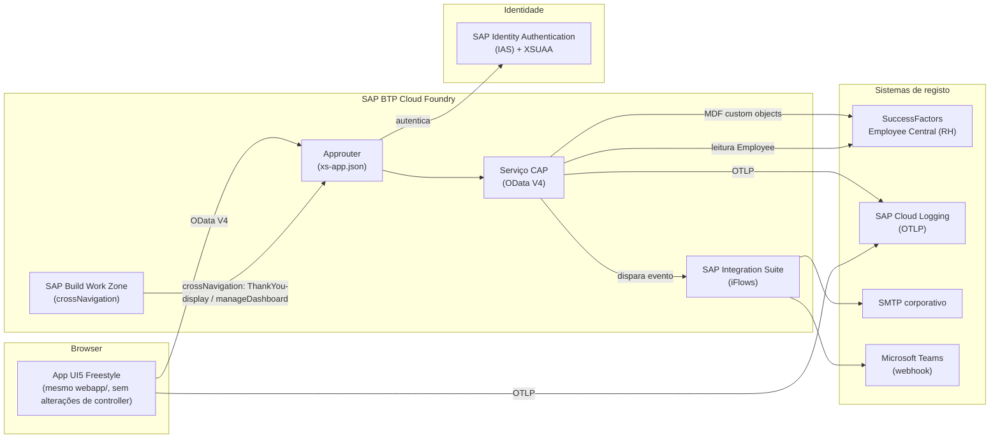

# Migração para SAP BTP — Thank You

Plano de migração do mockup Vercel para SAP BTP Cloud Foundry, com SAP SuccessFactors Employee Central (EC) como backend de RH, SAP Integration Suite para as integrações, e SAP IAS/XSUAA para autenticação. **Nada aqui é assumido como implementado** — é o plano que a arquitetura em Vercel foi desenhada para não bloquear (ver `CLAUDE.md`: "cada serviço só-BTP fica atrás de uma abstração... nunca chamado diretamente pelos controllers").

## 1. O que já está pronto para a migração

A regra seguida desde a Fase 2 foi: **nenhum controller UI5 ou rota Vercel chama uma capability de plataforma diretamente** — tudo passa por uma interface com 2–3 implementações, selecionadas por variável de ambiente em build-time (`scripts/generate-runtime-config.mjs`):

| Camada       | Interface             | Implementação Vercel (ativa)                             | Implementação BTP (esqueleto)                                           | Selector         |
| ------------ | --------------------- | -------------------------------------------------------- | ----------------------------------------------------------------------- | ---------------- |
| Dados        | `IRecognitionService` | `MockRecognitionService` / `VercelApiRecognitionService` | `ODataRecognitionService` (lança `NOT_IMPLEMENTED` em todos os métodos) | `DATA_SOURCE`    |
| Autenticação | `IAuthService`        | `DemoAuthService` (seletor de utilizador simulado na UI) | `IasAuthService` (lê de token/approuter, lança por implementar)         | `AUTH_MODE`      |
| Telemetria   | `ITelemetryService`   | `ConsoleTelemetryService`                                | `OtelCollectorTelemetryService` (lança por implementar)                 | `TELEMETRY_MODE` |

Isto significa que a migração é, por desenho, uma questão de **escrever as três classes esqueleto acima** (mais o CAP service e o approuter, secções seguintes) — não reescrever `webapp/controller/` nem `webapp/view/`.

## 2. Arquitetura alvo



## 3. Autenticação — SAP IAS/XSUAA + approuter

### 3.1 `xs-app.json` (approuter)

```jsonc
{
    "welcomeFile": "/index.html",
    "authenticationMethod": "route",
    "routes": [
        {
            "source": "^/api/(.*)$",
            "target": "/odata/v4/thankyou/$1",
            "destination": "thankyou-srv",
            "authenticationType": "xsuaa"
        },
        {
            "source": "^(.*)$",
            "target": "$1",
            "localDir": "webapp",
            "authenticationType": "xsuaa"
        }
    ]
}
```

- `authenticationType: xsuaa` em todas as rotas — sem exceção "pública", ao contrário de Vercel onde `DATA_SOURCE=mock` corre sem autenticação real (secção "Sem autenticação real nesta fase" do `CLAUDE.md`, explicitamente só válida na fase atual).
- O mapeamento `EMPLOYEE`/`ADMIN` (requisito 10) sai dos papéis XSUAA definidos em `xs-security.json`, propagados ao approuter como claims do token IAS — nunca de um cabeçalho `x-demo-role` como em `api/_lib/auth.ts` hoje.

### 3.2 `xs-security.json` (esqueleto de papéis)

```jsonc
{
    "xsappname": "thankyou",
    "tenant-mode": "dedicated",
    "scopes": [
        { "name": "$XSAPPNAME.Employee", "description": "Utilizador standard" },
        { "name": "$XSAPPNAME.Admin", "description": "Gestor de plataforma" }
    ],
    "role-templates": [
        { "name": "Employee", "scope-references": ["$XSAPPNAME.Employee"] },
        { "name": "Admin", "scope-references": ["$XSAPPNAME.Employee", "$XSAPPNAME.Admin"] }
    ]
}
```

### 3.3 `IasAuthService.ts` — o que muda

Hoje (`webapp/service/IasAuthService.ts`) lança `Error("por implementar")` nos 3 métodos. Em BTP:

- `getCurrentUser()`: lê `req.headers["x-forwarded-user"]` (ou os claims do token XSUAA propagados pelo approuter ao CAP service, expostos via `req.user` no handler CAP) — nunca `DemoUserStore.ts`, que é exclusivo do modo `demo`.
- `hasRole(role)`: verifica `req.user.is(role)` (API do CAP/XSUAA), mapeado 1:1 para `EMPLOYEE`/`ADMIN` via os `role-templates` acima.
- `getPermissions()`: `req.user.roles` do XSUAA.

O contrato (`CurrentUser`, `UserRole`) mantém-se — `Home.controller.ts`/`Admin.controller.ts` não mudam uma linha.

## 4. Dados — troca de `DATA_SOURCE=vercel-api` para `DATA_SOURCE=odata`

### 4.1 Plano CAP

Um serviço CAP (`srv/thankyou-service.cds`) expõe as mesmas 6 entidades como OData V4, consumidas por `sap.ui.model.odata.v4.ODataModel` em vez de `fetch()`:

```cds
using { managed } from '@sap/cds/common';

entity Employee : managed {
    key id        : String(8);  // PERNR — ver secção "Codificação" do CLAUDE.md
        name      : String;
        orgArea   : String;
        photoUrl  : String;
        email     : String;
        managerId : String(8);
        active    : Boolean;
}

entity EmployeeExclusion : managed {
    key id         : UUID;
        employeeId : Association to Employee;
        reason     : String;
        createdBy  : Association to Employee;
        active     : Boolean;
}

entity RecognitionCategory : managed {
    key id               : UUID;
        code              : String;
        labelKey          : String;
        parentCategoryId  : Association to RecognitionCategory;
        order             : Integer;
        active            : Boolean;
}

entity ClosedQuestion : managed {
    key id         : UUID;
        categoryId : Association to RecognitionCategory;
        code       : String;
        labelKey   : String;
        answerType : String enum { BOOLEAN; SINGLE_CHOICE; };
        options    : array of String; // lista pequena e fixa (3 valores) — não JSON, ver docs/modelo-dados.md
        order      : Integer;
        active     : Boolean;
}

entity NotificationMetadata : managed {
    key id             : UUID;
        eventType      : String;
        channel        : String enum { EMAIL; TEAMS; };
        templateKey    : String;
        subjectKey     : String;
        recipientsRule : String enum { RECIPIENT; AUTHOR; MANAGER_OF_RECIPIENT; ADMIN; };
        active         : Boolean;
}

entity RecognitionRecord : managed {
    key id              : UUID;
        author           : Association to Employee;      // authorId — persiste sempre, ver secção 5
        recipient        : Association to Employee;
        isAnonymous      : Boolean;
        message          : String(500);
        categoryRatings  : Composition of many CategoryRating on categoryRatings.record = $self;
        closedAnswers    : Composition of many ClosedAnswer on closedAnswers.record = $self;
        overallRating    : Decimal(2,1);
        status           : String enum { SUBMITTED; };
}

entity CategoryRating {
    key record       : Association to RecognitionRecord;
    key category     : Association to RecognitionCategory;
        rating       : Integer;
        observations : String;
}

entity ClosedAnswer {
    key record        : Association to RecognitionRecord;
    key closedQuestion : Association to ClosedQuestion;
        answerValue    : String;
}
```

`Employee` **não** é um MDF custom object — é uma vista/réplica da entidade `Person`/`EmpEmployment` do SuccessFactors EC (via SFAPI/OData do EC, ou réplica batch para leitura rápida — decisão de performance a validar com a equipa de integração, não assumida aqui).

### 4.2 `ODataRecognitionService.ts` — o que muda

Hoje lança `NOT_IMPLEMENTED` nos 9 métodos de `IRecognitionService`. Em BTP, cada método troca a chamada `fetch("/api/...")` por uma leitura/escrita no `ODataModel` v4 já configurado em `manifest.json` (`dataSources.mainService`, hoje com `uri: "/api/"` — troca-se só o `uri` para o serviço CAP e `type` para `"ODataV4"`; nenhum controller que consome `IRecognitionService` muda).

### 4.3 Regras de negócio (anonimização, auto-elogio) em CAP

As regras hoje duplicadas em `api/_lib/{anonymize,validation}.ts` e `webapp/service/{anonymize,validation}.ts` (deliberadamente — ver comentários nesses ficheiros) migram para **handlers CAP** (`srv/thankyou-service.js`, `before CREATE`/`after READ` em `RecognitionRecord`), continuando a valer a mesma regra: `authorId` persiste sempre na base de dados, só a serialização de leitura o omite; auto-elogio é rejeitado no servidor independentemente do frontend.

## 5. Entidade ↔ objeto MDF SuccessFactors (correspondência)

| Entidade (este projeto) | Objeto SuccessFactors EC                                             | Nota                                                                     |
| ----------------------- | -------------------------------------------------------------------- | ------------------------------------------------------------------------ |
| `Employee`              | `Person` + `EmpEmployment` (standard, não MDF)                       | Leitura via SFAPI OData; `id` = `personIdExternal`                       |
| `EmployeeExclusion`     | MDF custom object `cust_ThankYouExclusion`                           | 1 registo por colaborador excluído                                       |
| `RecognitionCategory`   | MDF custom object `cust_ThankYouCategory`                            | `parentCategoryId` = associação MDF a si própria                         |
| `ClosedQuestion`        | MDF custom object `cust_ThankYouClosedQuestion`                      | Associação MDF a `cust_ThankYouCategory`                                 |
| `NotificationMetadata`  | MDF custom object `cust_ThankYouNotifMetadata`                       | Configuração, não dado transacional                                      |
| `RecognitionRecord`     | MDF custom object `cust_ThankYouRecognition` (+ 2 child objects MDF) | `categoryRatings`/`closedAnswers` como child MDF objects, não JSON solto |

Nomes `cust_*` são propostas de convenção SAP, a confirmar com a equipa responsável pelo tenant SuccessFactors — não existe acesso a um tenant real nesta fase.

## 6. Vercel Functions ↔ iFlows SAP Integration Suite

`CLAUDE.md` limita a ≤7 flows; há exatamente 6 rotas hoje em `api/`, cada uma mapeável 1:1:

| Vercel Function (`api/*.ts`) | iFlow equivalente                   | Trigger                                                                                                                                                                                                                  |
| ---------------------------- | ----------------------------------- | ------------------------------------------------------------------------------------------------------------------------------------------------------------------------------------------------------------------------ |
| `employees.ts`               | `IF_ThankYou_SearchEmployees`       | Chamado pelo CAP service (lookup síncrono a EC)                                                                                                                                                                          |
| `categories.ts`              | `IF_ThankYou_GetCategories`         | Leitura direta de MDF (pode nem precisar de iFlow — CAP lê diretamente; mantido na tabela por simetria com a Fase 2)                                                                                                     |
| `recognitions.ts`            | `IF_ThankYou_SubmitRecognition`     | Disparado por `after CREATE` no CAP; valida, persiste, dispara notificações                                                                                                                                              |
| `top-performers.ts`          | `IF_ThankYou_AggregateCounters`     | Agendado (cache) ou on-demand, conforme volume                                                                                                                                                                           |
| `dashboard-metrics.ts`       | `IF_ThankYou_DashboardMetrics`      | On-demand, só ADMIN (requisito 10)                                                                                                                                                                                       |
| `notifications.ts`           | `IF_ThankYou_DispatchNotifications` | Disparado por `RECOGNITION_RECEIVED`/`RECOGNITION_SUBMITTED` (evento CAP) — substitui `api/_lib/notifications.ts`, que envia para SMTP corporativo e webhook do Teams em vez de só registar o payload (requisitos 6 e 9) |

`api/_lib/telemetry.ts` (erros) e o instrumentation embutido nos outros 6 handlers **não** viram um iFlow — continuam código de aplicação (CAP service handlers), só trocam o exporter OTLP (ver secção 8).

## 7. SAP Build Work Zone — `crossNavigation`

`webapp/manifest.json` já declara os 2 inbounds usados pela navegação semântica (preenchidos desde a Fase 2, sem esperar pela migração):

```json
"crossNavigation": {
    "inbounds": {
        "thankYouHome": { "semanticObject": "ThankYou", "action": "display" },
        "thankYouAdmin": { "semanticObject": "ThankYou", "action": "manageDashboard" }
    }
}
```

Em BTP, isto regista-se no catálogo do Work Zone como duas tiles (`ThankYou-display` para todos os `EMPLOYEE`/`ADMIN`, `ThankYou-manageDashboard` restrito ao papel `Admin` do `xs-security.json`, secção 3.2) — sem alterações ao `manifest.json` em si, só a criação das tiles/catálogos/grupos no site do Work Zone.

## 8. Telemetria — de `console` para `otel-collector`

Já implementado como troca de exporter, não de instrumentação (ver `docs/analise-funcional.md` secção 6 para o porquê da implementação browser não usar o SDK diretamente):

- Definir `OTEL_EXPORTER_OTLP_ENDPOINT` (build-time) → `TELEMETRY_MODE=otel-collector` → `OtelCollectorTelemetryService` (`webapp/service/telemetry/`) deixa de lançar `NOT_IMPLEMENTED`.
- **Servidor** (`api/_lib/telemetry.ts`, CAP em BTP): troca-se só o `SpanExporter` — de `ConsoleSpanExporter` para um `OTLPTraceExporter` (`@opentelemetry/exporter-trace-otlp-http`) apontado ao SAP Cloud Logging Service. Zero mudanças nos pontos de instrumentação.
- **Browser**: como o `ui5 build` (Freestyle, AMD) não resolve pacotes npm em runtime (limitação confirmada na Fase 7 — ver decisão em `docs/analise-funcional.md`), esta implementação exige um bundle próprio para o browser (webpack/esbuild, produzindo um `.js` UMD/IIFE incluído via `<script>` ou path-mapped no loader UI5) antes de poder usar `@opentelemetry/sdk-trace-web` real — trabalho de build pipeline, não de instrumentação.

## 9. Dependências npm — o que sobrevive à migração

| Pacote                                                   |   Sobrevive?   | Nota                                                                                       |
| -------------------------------------------------------- | :------------: | ------------------------------------------------------------------------------------------ |
| `@openui5/types`, `@ui5/cli`, `ui5-tooling-transpile`    |      Sim       | O `webapp/` não muda de framework nem de toolchain de build                                |
| `typescript`, `typescript-eslint`, `eslint*`, `prettier` |      Sim       | Toolchain de qualidade, independente da plataforma de deploy                               |
| `karma*`                                                 |      Sim       | Testes QUnit continuam a correr da mesma forma                                             |
| `@vercel/node`                                           |    **Não**     | Troca-se por `@sap/cds` (CAP) — os handlers deixam de ser `VercelRequest`/`VercelResponse` |
| `@opentelemetry/api`, `@opentelemetry/sdk-trace-base`    | Sim (servidor) | Reutilizados tal e qual no CAP service; só o exporter muda (secção 8)                      |
| — (novo) `@sap/cds`, `@sap/cds-dk`                       | **Adicionar**  | Runtime e CLI do CAP service                                                               |
| — (novo) `@opentelemetry/exporter-trace-otlp-http`       | **Adicionar**  | Exporter OTLP para o SAP Cloud Logging Service                                             |
| — (novo, browser) bundle OTel Web via webpack/esbuild    | **Adicionar**  | Ver secção 8 — só se `OtelCollectorTelemetryService` for implementado                      |

## 10. Checklist de migração (faseada, não implementada nesta fase)

1. Provisionar subaccount BTP Cloud Foundry + instâncias (XSUAA, destination, connectivity, Cloud Logging).
2. Criar `xs-security.json`/`xs-app.json` (secção 3) e o módulo approuter no `mta.yaml`.
3. Escrever o serviço CAP (`srv/thankyou-service.cds` + handlers, secção 4) contra uma base de dados HANA/SQLite de desenvolvimento, com os dados de seed atuais (`webapp/localService/mockdata/*`, `api/_data/*.json`) como fixtures CAP.
4. Implementar `IasAuthService.ts` (secção 3.3) e `ODataRecognitionService.ts` (secção 4.2) — os únicos ficheiros webapp que mudam de "lança erro" para "funciona".
5. Trocar `dataSources.mainService.uri`/`type` em `manifest.json` para o serviço CAP; `DATA_SOURCE=odata`, `AUTH_MODE=ias` no build BTP.
6. Ligar o CAP service à réplica/API do SuccessFactors EC para `Employee`, e criar os 5 MDF custom objects (secção 5) no tenant EC de destino.
7. Migrar os 6 handlers `api/*.ts` para os iFlows correspondentes (secção 6), incluindo o envio real de email/Teams em `notifications.ts` (hoje stub).
8. Registar as tiles no SAP Build Work Zone (secção 7) a partir do `crossNavigation` já existente.
9. Ativar `TELEMETRY_MODE=otel-collector` no servidor; avaliar se vale a pena o bundle browser (secção 8) ou se o instrumentation server-side já cobre o requisito 11 para o volume de uso esperado.
10. Rever `vercel.json` (CSP/HSTS/Permissions-Policy) — o approuter tem o seu próprio mecanismo de cabeçalhos de segurança (`xs-app.json` não os define; ficam a cargo de um middleware Node customizado no approuter ou do CAP service), a configuração não se copia 1:1.
