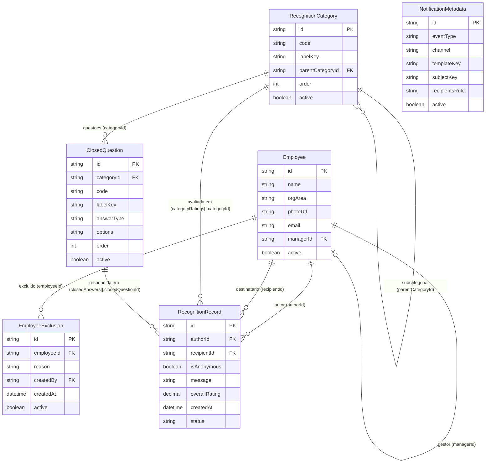
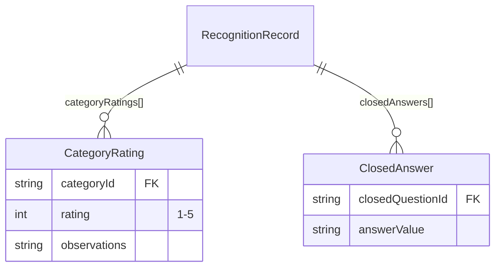

# Modelo de Dados — Thank You

Seis entidades: cinco objetos de configuração/registo que, no destino BTP, serão objetos **MDF custom** em SAP SuccessFactors Employee Central, mais `Employee`, lida do backend de RH. Nomes e forma mantidos iguais entre Vercel e BTP — a migração é troca de fonte, não redesenho.

## 1. Diagrama entidade-relação

`categoryRatings` e `closedAnswers` são **composições** dentro de `RecognitionRecord` (repeating structure / associação a MDF child object no mesmo objeto pai), não entidades de topo — a proposta fixa exatamente cinco objetos de configuração/registo mais `Employee`, por isso não são modeladas como uma sexta entidade independente:

## 2. Entidades

### Employee (lida do backend de RH — não é MDF custom, é a entidade Person/EC)

| Campo     | Tipo                           | Nota                                   |
| --------- | ------------------------------ | -------------------------------------- |
| id        | string (PK)                    | equivalente a `personIdExternal` em EC |
| name      | string                         |                                        |
| orgArea   | string                         | área organizacional                    |
| photoUrl  | string                         |                                        |
| email     | string                         |                                        |
| managerId | string (FK Employee, nullable) |                                        |
| active    | boolean                        |                                        |

### EmployeeExclusion (config)

Colaboradores excluídos da plataforma — aplicados no serviço ao construir a lista de pesquisa (requisito 1), nunca só filtrados na UI.

| Campo      | Tipo                 | Nota                       |
| ---------- | -------------------- | -------------------------- |
| id         | string (PK)          |                            |
| employeeId | string (FK Employee) |                            |
| reason     | string               |                            |
| createdBy  | string (FK Employee) | admin que criou a exclusão |
| createdAt  | datetime             |                            |
| active     | boolean              |                            |

### RecognitionCategory (config)

Categorias e subcategorias de reconhecimento, dados de configuração — nunca hardcoded na UI (IconTabBar lê daqui).

| Campo            | Tipo                                      | Nota                                                  |
| ---------------- | ----------------------------------------- | ----------------------------------------------------- |
| id               | string (PK)                               |                                                       |
| code             | string                                    | chave de negócio, ex. `PERFORMANCE`                   |
| labelKey         | string                                    | chave i18n                                            |
| parentCategoryId | string (FK RecognitionCategory, nullable) | `null` = categoria de topo; preenchido = subcategoria |
| order            | int                                       | ordem de apresentação                                 |
| active           | boolean                                   |                                                       |

### ClosedQuestion (config)

Questões fechadas associadas a uma categoria — apresentadas no dialog, dentro do tab da categoria correspondente.

| Campo      | Tipo                            | Nota                                              |
| ---------- | ------------------------------- | ------------------------------------------------- |
| id         | string (PK)                     |                                                   |
| categoryId | string (FK RecognitionCategory) |                                                   |
| code       | string                          |                                                   |
| labelKey   | string                          |                                                   |
| answerType | string                          | `BOOLEAN` \| `SINGLE_CHOICE`                      |
| options    | string                          | JSON de opções, só relevante para `SINGLE_CHOICE` |
| order      | int                             |                                                   |
| active     | boolean                         |                                                   |

### NotificationMetadata (config)

Configuração de metadados para envio de notificações (email/Teams).

| Campo          | Tipo        | Nota                                                         |
| -------------- | ----------- | ------------------------------------------------------------ |
| id             | string (PK) |                                                              |
| eventType      | string      | ex. `RECOGNITION_RECEIVED`                                   |
| channel        | string      | `EMAIL` \| `TEAMS`                                           |
| templateKey    | string      |                                                              |
| subjectKey     | string      | chave i18n do assunto                                        |
| recipientsRule | string      | `RECIPIENT` \| `AUTHOR` \| `MANAGER_OF_RECIPIENT` \| `ADMIN` |
| active         | boolean     |                                                              |

### RecognitionRecord (registo transacional)

| Campo           | Tipo                 | Nota                                                                          |
| --------------- | -------------------- | ----------------------------------------------------------------------------- |
| id              | string (PK)          |                                                                               |
| authorId        | string (FK Employee) | **persiste sempre**, ver regra de anonimato abaixo                            |
| recipientId     | string (FK Employee) | nunca pode ser igual a `authorId` — regra de auto-elogio, validada no serviço |
| isAnonymous     | boolean              |                                                                               |
| message         | string               | mensagem final                                                                |
| categoryRatings | composição           | `{ categoryId, rating (1–5), observations }[]`                                |
| closedAnswers   | composição           | `{ closedQuestionId, answerValue }[]`                                         |
| overallRating   | decimal              | média de `categoryRatings[].rating`                                           |
| createdAt       | datetime             |                                                                               |
| status          | string               | `SUBMITTED` (sem workflow de aprovação — reconhecimento é direto)             |

## 3. Regra de anonimato (requisito 4)

- `authorId` **persiste sempre** em `RecognitionRecord`, em qualquer registo — a informação nunca se perde no backend.
- Quando `isAnonymous = true`, o **serviço** (nunca a view) omite `authorId`/dados do autor na serialização de leitura: a API de leitura devolve `author: null` e um indicador `isAnonymous: true`; a UI mostra "Anónimo" com avatar neutro.
- Exceção: `ADMIN` não tem acesso a um "modo revelar" nesta fase — a anonimização é incondicional na API de leitura pública/agregada. Se for necessário auditoria por ADMIN a `authorId` de registos anónimos, é uma decisão de negócio a validar antes de implementar (não assumido).
- A regra é imposta no serviço de leitura (`api/recognitions.ts` em Vercel), nunca só escondida no formatter da view — testada ao nível do serviço (Fase 3).

## 4. Regra de auto-elogio (requisito 5)

- `recipientId !== authorId`, validado:
    1. No frontend (dialog), como feedback imediato inline.
    2. No serviço, como guarda final — uma regra só em frontend é contornável por chamada direta à API.
- Testada ao nível do serviço (Fase 3), não só QUnit de UI.
